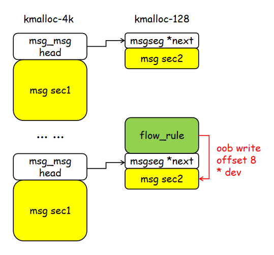

# CVE-2022-25636 netfilter内核提权

[toc]

## 漏洞简介

漏洞编号: CVE-2022-25636

漏洞产品: linux kernel - netfilter

影响版本: linux kernel 5.4 ~

漏洞危害: netfilter 内核模块中存在堆越界写，存在SYS_ADMIN时可以造成提权

## 环境搭建

漏洞存在于netfilter 内核模块中，漏洞所在代码在3个ko 中。

```
nft_dup_netdev.ko  
nf_dup_netdev.ko 
nf_tables.ko 
```

直接qemu 启动有问题，ko 装载不上，使用vmware双机联调。

ubuntu 21.10 可以手动替换内核：

```sh
apt-get install linux-image-5.13.0-30-generic
```

然后删除原本的内核，编译[exp](https://github.com/Bonfee/CVE-2022-25636.git) :

```sh
git clone https://github.com/Bonfee/CVE-2022-25636.git
apt-get install libmnl-dev
apt-get install libfuse-dev
apt-get install libnftnl-dev
make
./exploit
```

提权效果(成功率不到5成)：


## 漏洞原理

### 漏洞发生点

漏洞所在函数为`nft_fwd_dup_netdev_offload`:

linux\net\netfilter\nf_dup_netdev.c : 67 : nft_fwd_dup_netdev_offload

```c
int nft_fwd_dup_netdev_offload(struct nft_offload_ctx *ctx,
			       struct nft_flow_rule *flow,
			       enum flow_action_id id, int oif)
{
	struct flow_action_entry *entry;
	struct net_device *dev;

	/* nft_flow_rule_destroy() releases the reference on this device. */
	dev = dev_get_by_index(ctx->net, oif);
	if (!dev)
		return -EOPNOTSUPP;

	entry = &flow->rule->action.entries[ctx->num_actions++];//越界
	entry->id = id;
	entry->dev = dev;

	return 0;
}
EXPORT_SYMBOL_GPL(nft_fwd_dup_netdev_offload);
```

在设置`flow->rule->action.entries`(该结构体为变长结构体没有)时没有堆边界进行检查，导致越界写一个整数(4或5)和一个指针。

### 调用栈

函数的使用在 `nft_flow_rule_create` 函数中 ：

linux\net\netfilter\nf_tables_offload.c : 90 : nft_flow_rule_create 

```c
struct nft_flow_rule *nft_flow_rule_create(struct net *net,
					   const struct nft_rule *rule)
{
	struct nft_offload_ctx *ctx;
	struct nft_flow_rule *flow;
	int num_actions = 0, err;
	struct nft_expr *expr;

	expr = nft_expr_first(rule);
	while (nft_expr_more(rule, expr)) {//根据传入reule 的数量计算num_actions
		if (expr->ops->offload_flags & NFT_OFFLOAD_F_ACTION)
			num_actions++;// 只有带有NFT_OFFLOAD_F_ACTION 标记才计数

		expr = nft_expr_next(expr);
	}

	if (num_actions == 0)
		return ERR_PTR(-EOPNOTSUPP);

	flow = nft_flow_rule_alloc(num_actions);//根据num_actions 数量申请空间(变长结构体)
	if (!flow)
		return ERR_PTR(-ENOMEM);

	expr = nft_expr_first(rule);
	//ctx->num_actions 初始化为0 ↓
	ctx = kzalloc(sizeof(struct nft_offload_ctx), GFP_KERNEL);
	if (!ctx) {
		err = -ENOMEM;
		goto err_out;
	}
	ctx->net = net;
	ctx->dep.type = NFT_OFFLOAD_DEP_UNSPEC;

	while (nft_expr_more(rule, expr)) {
		if (!expr->ops->offload) {//根据rule数量调用offload
			err = -EOPNOTSUPP;
			goto err_out;
		}
		err = expr->ops->offload(ctx, flow, expr);//调用漏洞函数
		if (err < 0)
			goto err_out;

		expr = nft_expr_next(expr);
	}
	··· ···
    ··· ···
}
```

可以看到`nft_flow_rule_create` 函数根据用户空间传入的rule 结构数量来申请`flow` 结构体并进行处理。使用`num_actions` 变量来计数，但计数过程中只计算带有`NFT_OFFLOAD_F_ACTION` flag 标记的rule，并根据数量申请相应大小的结构体。后续调用`offload` 处理的时候，却没有使用`num_actions` 来进行循环。而是和之前一样进行rule 数量的次数的循环，但这里没有再进行flag的`NFT_OFFLOAD_F_ACTION` 判断。也就是说，当传入的rule 中有不带`NFT_OFFLOAD_F_ACTION` 标记的flag 的时候，后续调用`offload` 的次数是大于之前申请的`flow->rule->action.entries` 数量的，在`offload` 里会调用漏洞函数`nft_fwd_dup_netdev_offload`，每次调用`ctx->num_actions` 会加一，且`ctx->num_actions` 初始化为0，最后`ctx->num_actions` 会大于`flow->rule->action.entries`数组范围，造成越界。

一些结构体：

```c
struct nft_flow_rule {
	__be16			proto;
	struct nft_flow_match	match;
	struct flow_rule	*rule;
};

struct flow_rule {
	struct flow_match	match;
	struct flow_action	action;
};

struct flow_action {
	unsigned int			num_entries;
	struct flow_action_entry	entries[];
};

struct flow_action_entry {
	enum flow_action_id		id;
	enum flow_action_hw_stats	hw_stats;
	action_destr			destructor;
	void				*destructor_priv;
	union {
		u32			chain_index;	/* FLOW_ACTION_GOTO */
		struct net_device	*dev;		/* FLOW_ACTION_REDIRECT */
		··· ···
	};
	struct flow_action_cookie *cookie; /* user defined action cookie */
};

struct nft_offload_ctx {
	struct {
		enum nft_offload_dep_type	type;
		__be16				l3num;
		u8				protonum;
	} dep;
	unsigned int				num_actions;
	struct net				*net;
	struct nft_offload_reg			regs[NFT_REG32_15 + 1];
};
```

调用栈：

- nft_flow_rule_create
  - nft_dup_netdev_offload/nft_fwd_netdev_offload
    - nft_fwd_dup_netdev_offload

### netfilter的使用以及触发

参考链接：https://www.openwall.com/lists/oss-security/2022/02/21/2

该邮件说明了如何用C语言的libmnl和libnftnl 库来使用netfilter，主要触发漏洞的点在于添加的rule是否存在`NFT_OFFLOAD_F_ACTION`  flag 标记。只有`nftnl_expr_alloc("immediate"); `添加的rule才有`NFT_OFFLOAD_F_ACTION`  标记：

```c
for(int i = 0; i < legit_writes; i++) {//如下添加expr 不会越界
    exprs[exprid] = nftnl_expr_alloc("immediate");
    nftnl_expr_set_u32(exprs[exprid], NFTNL_EXPR_IMM_DREG, NFT_REG_1);
    nftnl_expr_set_u32(exprs[exprid], NFTNL_EXPR_IMM_DATA, 1);
    nftnl_rule_add_expr(rule, exprs[exprid]);
    exprid++;
    exprs[exprid] = nftnl_expr_alloc("dup");
    nftnl_expr_set_u32(exprs[exprid], NFTNL_EXPR_DUP_SREG_DEV, NFT_REG_1);
    nftnl_rule_add_expr(rule, exprs[exprid]);
    exprid++;
}
//如下添加expr 会越界
for (int unaccounted_dup = 0; unaccounted_dup < oob_writes; unaccounted_dup++) {
    exprs[exprid] = nftnl_expr_alloc("dup");
    nftnl_expr_set_u32(exprs[exprid], NFTNL_EXPR_DUP_SREG_DEV, NFT_REG_1);
    nftnl_rule_add_expr(rule, exprs[exprid]);
    exprid++;
}
```

## 漏洞利用

漏洞利用不是很稳定，但利用技术很精妙，漏洞是越界固定偏移的位置写一个不可控指针，个人认为利用难度非常高。简单分析一下技术手法把。根据漏洞的代码，可以知道，每次越界只能写一个整数(id，固定为4或5)和一个指针(*dev)，其中指针指向`struct net_device`  结构体。我们这里只关注dev 指针写:

```c
int nft_fwd_dup_netdev_offload(struct nft_offload_ctx *ctx,
			       struct nft_flow_rule *flow,
			       enum flow_action_id id, int oif)
{
	··· ···
	entry = &flow->rule->action.entries[ctx->num_actions++];//越界
	entry->id = id;
	entry->dev = dev; //固定偏移写一个堆地址，dev 为struct net_device 结构体
	··· ···
}
```

关于` struct flow_rule` 结构体，由于是一个变长结构体，所以他能申请到的大小范围关乎到能否利用(成功)

- 当只传入一个rule 的时候，该结构体大小为0x70，属于kmalloc-128(0x80) ，如果发生越界，则dev 指针会写到0x88 的位置，也就是越界0x8处
- 如果传入两个rule，则结构体大小为0xC0，正好属于kmalloc-192(0xC0)，如果发生越界，dev 指针会写到0xd8的位置，也就是越界0x18处，越界两次会在越界0x18 +0x50的地方...

相关结构体：

```c
struct flow_rule {
	struct flow_match	match;
	struct flow_action	action;
};

struct flow_match {
	struct flow_dissector	*dissector;
	void			*mask;
	void			*key;
};

struct flow_dissector {
	unsigned int used_keys; /* each bit repesents presence of one key id */
	unsigned short int offset[FLOW_DISSECTOR_KEY_MAX];
};

struct flow_action {
	unsigned int			num_entries;
	struct flow_action_entry	entries[];
};

struct flow_action_entry {//大小0x50
	enum flow_action_id		id;
	enum flow_action_hw_stats	hw_stats;
	action_destr			destructor;
	void				*destructor_priv;
	union {
		u32			chain_index;	/* FLOW_ACTION_GOTO */
		struct net_device	*dev;		/* FLOW_ACTION_REDIRECT */
		··· ···
	};
	struct flow_action_cookie *cookie; /* user defined action cookie */
};
```

### 泄露内核net_device结构体地址

进入漏洞利用，首先要泄露两次`*dev` 的地址，由于要泄露两个不同的dev地址，所以一个在本进程泄露，一个在子进程泄露。使用`msg_msg` 来泄露([msg_msg技术回顾](https://blog.csdn.net/Breeze_CAT/article/details/123007818))，堆喷大小为0x1040 的msg，这样由于msg 的结构，会分成两段，第二段msg 长度为0x70，加上头指针，会申请到kamalloc-128，然后释放一个msg，释放掉一个kmalloc-128。接下来使用只有一个rule 的`flow_rule`结构体，正好也是kmalloc-128，希望能申请到刚刚释放的msg 的第二段kmalloc-128组成如下的堆造型：



让`flow_rule`申请到释放的`msg_msgseg`结构后，大概率挨着其他堆喷的`msg_msgseg`，这样发生一次越界写，会在越界0x8的位置写一个`net_device`堆指针(dev指针)。只需要把刚堆喷的消息全接收一遍，就可以读到这个堆指针，完成地址泄露，用于后续利用，并且不会崩溃。

### setxattr来UAF泄露kaslr

接下来泄露kaslr，获得内核基址。用同样的方法，使用`msg_msg`+堆喷，堆喷一堆kmalloc-192 的msg，这回使用的是`msg_msg` 第一段作为堆喷目标。然后跟之前的方法相同，释放一个，然后申请`flow_rule`，争取构成如下堆造型：


这次使用的是带两个rule 的`flow_rule` 结构，大小为0xC0，正好属于kmalloc-192，如果越界写6次，会在越界0x18+0x50*5的地方写一个`* dev`指针，正好是下面第三个kmalloc-192 的偏移0x28 的地方，如果是`msg_msg` 结构体的话，就是`security`指针，这时如果使用`msgrcv` 函数释放这个`msg_msg` 结构体，他就会调用`kfree`，释放`security`指针指向的内容，这也是`msg_msg->security `的任意地址释放源语，相关代码如下：

```c
static long do_msgrcv(int msqid, void __user *buf, size_t bufsz, long msgtyp, int msgflg,
	       long (*msg_handler)(void __user *, struct msg_msg *, size_t))
{		
    ··· ···
    ··· ···
	free_msg(msg); 			
	··· ···
}

void free_msg(struct msg_msg *msg)
{
	··· ···
	security_msg_msg_free(msg);
	··· ···
}

void security_msg_msg_free(struct msg_msg *msg)
{
	call_void_hook(msg_msg_free_security, msg);
	kfree(msg->security);
	msg->security = NULL;
}
```

这样，对刚刚堆喷的消息进行接收操作，就会将我们覆盖`security` 的`dev` 指针释放掉，也就是释放掉`net_device` 结构体。接下来使用`setxattr`+userfaulted来尝试对该堆块进行篡改，完成UAF。`setxattr` 可以申请任意大小的内核堆，并写入任意内容，然后释放。内核漏洞利用的常见手段。

由于现在kernel中 free状态的kmalloc-192 有很多，只是用一次`setxattr`肯定是不够的，所以采用多线程同时调用`setxattr`，并且利用userfaulted 增加调用时间，增加堆块占用时间，争取申请更多内核堆，进而申请到刚释放的`net_device` 结构体。申请到就可以修改`net_device`结构体的内容了，修改里面的`dev_addr` 指针为`netdev_ops` 指针，因为`netdev_ops` 会初始化为`loopback_ops`，然后改一些名字之类的用来判断是否修改成功：

```c
    ((uint64_t*)(setxattr_bufs[i]))[2] = 0x6f6c; // dev->name = "lo"
    ((uint64_t*)(setxattr_bufs[i]))[104] = child_net_device_leak + 0xc8; // set dev_addr ptr
    ((uint64_t*)(setxattr_bufs[i]))[78] = 0x0808080800000000; // set addr_len to '0x08'
    ((uint64_t*)(setxattr_bufs[i]))[28] = 0x42424242; // ifindex
```

接下来只要调用`socket` 的`ioctl` 的`SIOCGIFHWADDR` 功能 读取物理地址，就可以读取到`loopback_ops` 的地址完成泄露。`net_device` 一些有用的成员如下：

```c
struct net_device {
	char			name[IFNAMSIZ]; //修改name判断是否改正确
	··· ···
	const struct net_device_ops *netdev_ops;//初始化为，用于泄露内核地址
	int			ifindex;   
	·· ···
	const struct  ethtool_ops *ethtool_ops; //用于劫持rip
	··· ···
	unsigned char		addr_len; //用于读取地址长度
	··· ···
	unsigned char		*dev_addr; //篡改用于泄露地址，被SIOCGIFHWADDR 读取
};
```

### 二次UAF完成内核rop

同样的办法使用`setxattr`+userfaulted完成UAF，这次我们有了内核地址之后，直接篡改`net_device` 的`ethtool_ops` 劫持eip，之后使用`socket` 的`iotl` 的`SIOCETHTOOL`功能，就会调用`ethtool_ops` 中的函数劫持rip，然后ROP即可。在ubuntu21.10 内核版本13.0-30 复现成功：

exp:https://github.com/Bonfee/CVE-2022-25636


## 参考

邮件：https://www.openwall.com/lists/oss-security/2022/02/21/2

作者文档：https://nickgregory.me/linux/security/2022/03/12/cve-2022-25636/

exp：https://github.com/Bonfee/CVE-2022-25636
